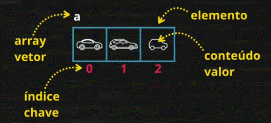

Fundamentais
***
 
 
# Memoria

 

## Variável Local
* `let número = 1`

## Variável Global
* `var número = 2`  

## Vetores

Também conhecidos como variáveis compostas ou array.

   

* `let vet = [5, 3, 4]`   &nbsp; &nbsp; &nbsp; Criar vetor e já passar valores.  

* `vet[3] = 'maçã'` &nbsp; &nbsp; &nbsp; Colocar 'maçã' no índice 3 do vetor.

### Algumas propriedades para vetores   

* `vet.push(7)` &nbsp; &nbsp; &nbsp; Colocar na próxima posição vaga do vetor VET o valor 7.

* `vet.length` &nbsp; &nbsp; &nbsp; Quantos elementos possui o vetor VET. (.length é um atributo e não um método).

* `vet.sort()` &nbsp; &nbsp; &nbsp; Ordenar os valores por ordem.

* `vet.indexOf(X)` &nbsp; &nbsp; &nbsp; Buscar qual posição se encontra o valor X, se não for encontrado nenhum X retorna o valor -1.

 

## Tipos de Dados

* Number        
   - Infinity
   - NaN
* String
* Boolean
* Null
* Undefined
* Object
   - Array
* Function

 _Obs.: Para ver o tipo da variável no note js: `typeof nome-da-variável`._    

## Conversões:

 **_String  -->  Number_**   

* `Number.parseInt(n)`        Forçar para que variável passe a ser do tipo int (inteiro).  

* `Number.parseFloat(n)`      Esse 'Number' pode ser omitido.  

* `Number(n)`                 O JavaScript adaptara a inter ou float.   

 **_String  -->  Number_**

* `String(v)`  

* `v.toString()`

 

## Formatação de String e +  

Dado: `var s = 'JavaScript'`, temos:

* `s.length`      Quantos caracteres a string tem.  

* `s.toUpperCase()`       Tudo para MAÚSCULA.  

* `s.toLowerCase()`       Tudo para MÍNUSCULA.  

 

Dado: `var n = 1512.6` , temos:

* `n.toFixed(2)`      Formatar o número de casas decimais para dois => 1 512.60.  

* `n.toFixed(2).replace('.',',')`        Aqui vamos além e formatamos o símbolo de separação => 1 512,6.

* `n.toLocaleString('pt-BR', {style: 'currency', currency: 'BRL'})`       Para mostra na notação de moeda brasileira.

 

# Operadores

## Atribuição

=

## Concatenação

\+

_Templete String_ ${}   ``alguma coisa ${variável}`` ( só funciona entre crases ).

## Aritméticos

`+` `-` ` *` ` /` ` %` (Resto da divisão inteira) `**` (Potenciação)

* Auto atribuição      `n += 2`  
* Incremento        `n++`  
* Decremento        `n--`

## Relacionais

`>` `<` `>=` `<=` `==` `!=`   

(Não há order de precedência). 

* `5 = '5'` -->  `true`      (Ambos tem o mesmo valor, embora não tenham o mesmo tipo).

* `5 === '5'`  -->  `false`     (Operador de Identidade ou Operador de Igualdade Restrita, esse verifica se ambos tem o mesmo valor e mesmo tipo). (`!===` desigual restrioto).

## Lógicos

`!` (Negação) `&&` (Conjunção) `||` (Disjunção) 

(Esta é a ordem de execução (precedência)).
