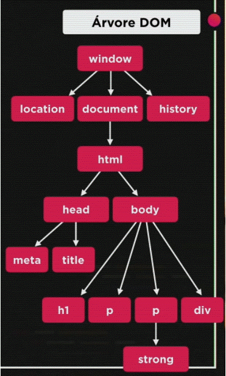

# Aula 6: 		Tratamentos de Dados.

Conversão de tipos.  
Concatenação.  
Alguma formatação de String.

# Aula 9:		Introdução ao DOM.

Document Object Model (só funciona no navegador). Ele é um facilitador para dar acesso aos elementos do HTML (está presente apenas em navegadores)

